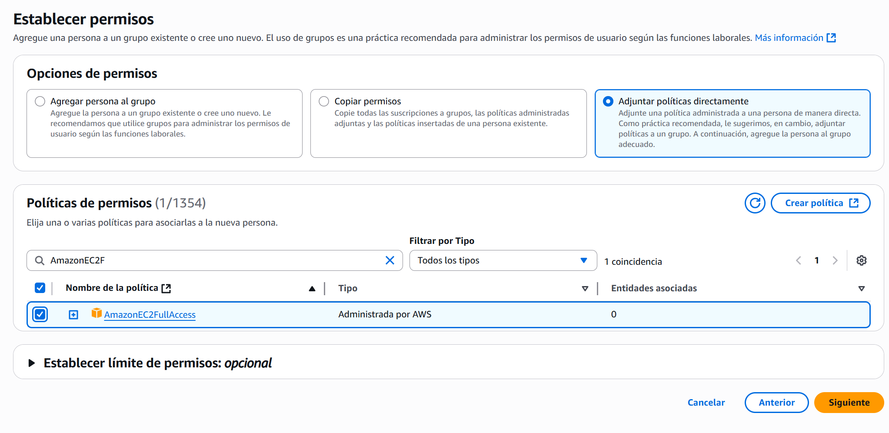
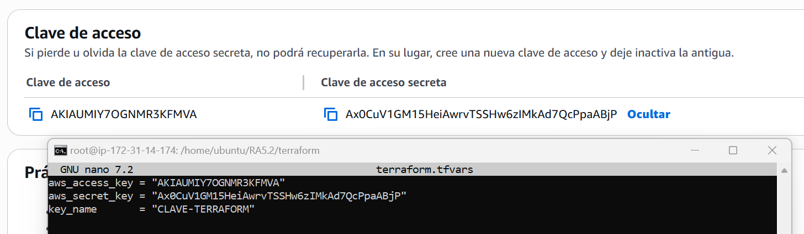
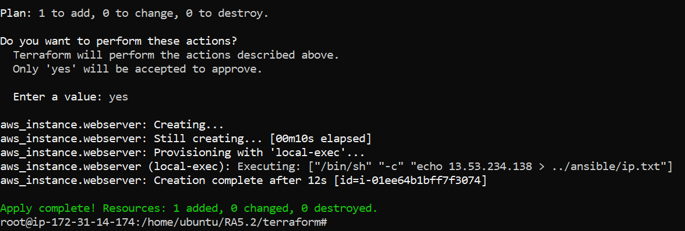
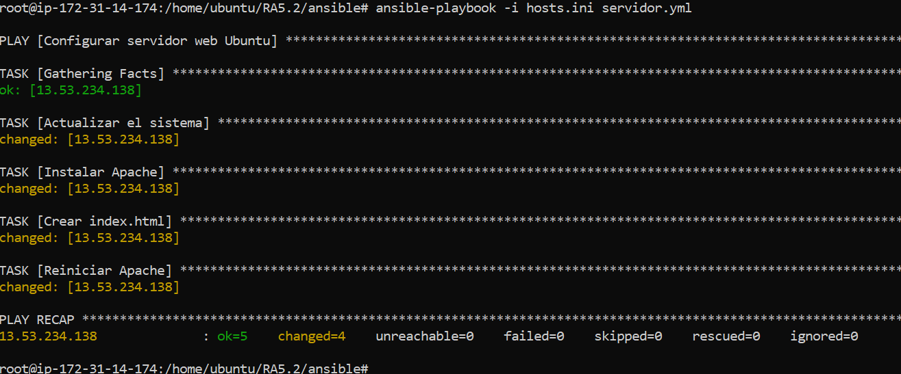
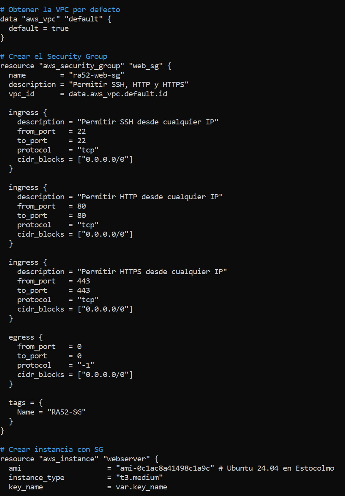

# Práctica RA5.2 - Despliegue con Terraform y Ansible en AWS

## 🔍 Objetivo

Automatizar el aprovisionamiento y configuración de una máquina virtual Ubuntu 24.04 en AWS utilizando **Terraform** para crear la infraestructura y **Ansible** para su configuración, sustituyendo VirtualBox por un entorno cloud real.

---

## ⚖️ Tecnologías usadas

* **AWS EC2** (región `eu-north-1`, Estocolmo)
* **Terraform v1.12+**
* **Ansible v2.15+**
* **Ubuntu 24.04 LTS**

---

## 📚 Estructura del proyecto

```
RA5.2/
├── ansible/
│   ├── hosts.ini
│   ├── ip.txt
│   └── servidor.yml
├── claves/
│   └── terraform.pem
├── terraform/
│   ├── main.tf
│   ├── terraform.tfstate
│   ├── terraform.tfstate.backup
│   ├── terraform.tfvars
│   └── variables.tf
```

---

## ✍️ Proceso paso a paso

### 1. Creación del usuario IAM

* Se creó un usuario `terraform-user` con la política **AmazonEC2FullAccess**.
* Se generó una **Access Key** y **Secret Key** que se usaron en `terraform.tfvars`.

**Captura:** *"IAM con política EC2 asignada"*



### 2. Generación de clave SSH

* Se generó `terraform.pem` y se importó en AWS como Key Pair (`CLAVE-TERRAFORM`). Además de sacar las claves privadas de AWS.

**Captura:** *"Claves privadas en AWS"*


### 3. Terraform: Aprovisionamiento de la instancia

* Se configuró una instancia Ubuntu 24.04 en AWS (`ami-0c1ac8a41498c1a9c` en Estocolmo).
* Tipo de instancia: `t3.medium`.
* Se implementó un **Security Group** personalizado en Terraform permitiendo:

  * **22 (SSH)**
  * **80 (HTTP)**
  * **443 (HTTPS)**
* La IP de la instancia se guarda automáticamente en `ansible/ip.txt`.

**Captura:** *"terraform apply completado con IP generada"*


### 4. Ansible: Configuración del servidor

* Se creó `hosts.ini` automáticamente con la IP y ruta al `.pem`.
* Se ejecutó el playbook `servidor.yml`, que:

  * Actualiza el sistema.
  * Instala Apache.
  * Crea `index.html` con texto `Ansible rocks`.
  * Reinicia Apache.

**Captura:** *"ansible-playbook ejecutado con éxito"*


### 5. Verificación final

* Se accedió por HTTP a la IP pública.
* Resultado: `Ansible rocks`

**Captura:** *"curl a la IP devuelve el mensaje correctamente"*


---

## 🔹 Extra: Creación del Security Group desde Terraform

Se añadió un recurso `aws_security_group` gestionado como código para evitar dependencias de la consola de AWS. Este grupo permite acceso por puertos 22, 80 y 443.

**Captura:** *"código de main.tf con Security Group y asociación a la instancia"*


---

## 📄 Archivos principales

### `servidor.yml`

```yaml
- name: Configurar servidor web Ubuntu
  hosts: webservers
  become: yes
  tasks:
    - name: Actualizar el sistema
      apt:
        update_cache: yes
        upgrade: dist

    - name: Instalar Apache
      apt:
        name: apache2
        state: present

    - name: Crear index.html
      copy:
        dest: /var/www/html/index.html
        content: "Ansible rocks"

    - name: Reiniciar Apache
      service:
        name: apache2
        state: restarted
```

---

## 🚀 Resultado final

* Infraestructura creada de forma declarativa.
* Configuración aplicada de forma automatizada.
* 100% reproducible y escalable.

**Estado:** ✅ Completado con éxito.

---
